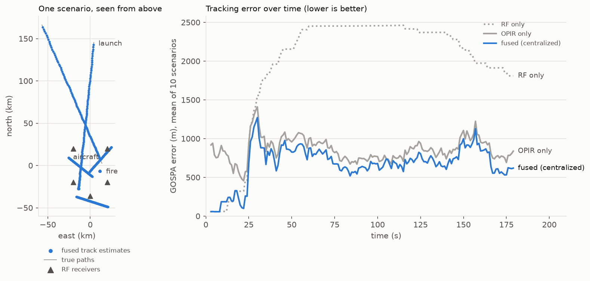
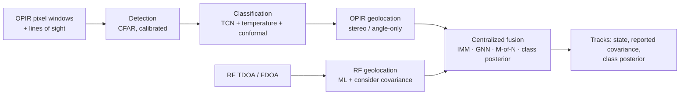

<p align="center">
  
</p>

<p align="center">
  <strong>Multi-sensor detection, classification, geolocation, and tracking for OPIR and RF</strong><br>
  <a href="https://github.com/Michael-Gurule/locant/actions/workflows/ci.yml"></a>
  
  
</p>

Locant fuses two sensors that each see half the picture.
- **Overhead persistent infrared (OPIR) satellites** see every hot event
  (launches, fires, explosions, aircraft) but measure only a direction.
- **RF receiver networks** locate emitters to tens of metres, but see only
  targets that transmit.

Locant detects events at a calibrated false-alarm rate, classifies them with
calibrated confidence, geolocates both kinds of measurement with honest
uncertainty, and fuses them into one track picture. Every component is
evaluated in seven experiments with confidence intervals, and every number
below is generated from those experiment reports.

> **Scope.** All data is produced by a physics-based simulator with
> illustrative, unclassified magnitudes. The results measure the methods,
> not any fielded system ([why](docs/adr/0003-synthetic-data-strategy.md)).
> Locant was formerly named SENTINEL ([v1 audit](docs/audit_v1.md)).

<p align="center">
  
</p>

*Left: one benchmark scenario seen from above, with fused track estimates
over the true paths. Right: the GOSPA tracking error over time, averaged
over 10 scenarios. RF alone misses the launches and the fire. OPIR alone
places aircraft about 4× worse. Fusion gets both.*

## Results at a glance

<!-- metrics:headline -->
| Area | Result |
|---|---|
| Detection (E1) | CFAR detects 66% of events at a calibrated 1% false-alarm rate; the v1 detector alarmed on 100% of pure-background windows |
| Classification (E2) | TCN macro-F1 0.806 on test and 0.579–0.737 under domain shift (feature baseline 0.720) |
| Uncertainty (E3) | 90% conformal sets cover 90.2% on test with 1.32 labels on average; two-stage alarms cut background false alarms from 24% to 5.6% |
| Geolocation (E4) | ML TDOA error 8.0 m against a Cramér-Rao bound of 8.3 m at 10 ns, NEES 2.90 (3 = consistent) |
| Fusion (E6) | GOSPA error 693 m fused vs 877 m OPIR-only and 1,961 m RF-only; NEES 3.1 |
| Robustness (E7) | RF outage: fused tracking keeps 100% of aircraft (RF alone 17%); RF bias: reported NEES 3.1–3.8 at every track age |
<!-- /metrics:headline -->

The [technical report](docs/technical_report.md) has every experiment's
question, setup, tables, figures, and limitations.

## Quick start

```bash
conda env create -f environment.yml
conda activate locant
make demo
```

`make demo` (`locant run configs/scenario/multi_int.yaml`) simulates a
radar-cued launch, two aircraft with datalinks, and a wildfire. A GEO and a
Molniya satellite observe them in stereo, and a five-receiver RF network
geolocates the emitters. Every frame runs through detection, classification,
geolocation, and fusion. The output is the tracking error against truth and
each track's class and sources, and the run is recorded in `runs/`.

`make check` runs everything CI runs: lint, strict type checking, more than
300 tests, the coverage gate, and the latency budgets.

## How it works



| Read | For |
|---|---|
| [Technical report](docs/technical_report.md) | Problem, methods, all seven experiments, limitations, future work |
| [Architecture](docs/architecture.md) | Components, per-frame sequence, package layering, reproducibility chain |
| [Geolocation](docs/geolocation.md) | TDOA/FDOA models, Chan-Ho, Cramér-Rao bound, systematic errors (E4) |
| [Tracking and fusion](docs/fusion.md) | OPIR geolocation, IMM tracker, fusion architectures, robustness (E5–E7) |
| [Model card](docs/model_card.md) · [Data card](docs/data_card.md) | The shipped classifier, and the simulated dataset |
| [Decision records](docs/adr/README.md) | Six ADRs: fusion architecture, configuration, data, association, calibration, frames |
| [v1 audit](docs/audit_v1.md) | Every defect in the prototype, its fix, and the test that guards it |

## Usage

### Command line

| Command | Purpose |
|---|---|
| `locant simulate SCENARIO [--seed N]` | Simulate a scenario; summarize what each sensor saw |
| `locant run SCENARIO [--pipeline YAML] [--seed N]` | Full pipeline, scored against truth, recorded as a run |
| `locant export-onnx [ARTIFACT]` | Export the classifier for ONNX Runtime (about 8× faster on CPU) |
| `locant data build / verify` | Build the dataset, or check it against its manifest |
| `locant runs list / show ID` | Inspect the run registry |

Global options: `--log-level`, and `--log-json` for one JSON event per line.
`python -m locant` is equivalent.

### Configuration and runs

Every tunable number of the processing chain is a field of `PipelineConfig`,
a validated pydantic model. Each section names the experiment that set its
default. `configs/pipeline/default.yaml` is the deployed configuration;
unknown or out-of-range values fail at load time. Each `locant run` and each
experiment launched from the command line writes `runs/<id>/run.json`. The
record holds the configuration and its hash, the seed, the git commit (marked
when the tree is dirty), package versions, timing, metrics, and artifacts
([ADR 0002](docs/adr/0002-configuration-cli-and-run-registry.md)).

### Python API

#### RF Geolocation (TDOA)

```python
import numpy as np

from locant.geolocation import Receiver, simulate_tdoa, solve_tdoa, tdoa_dop

receivers = [
    Receiver(0, np.array([0.0, 0.0, 500.0])),
    Receiver(1, np.array([10_000.0, 0.0, 1_500.0])),
    Receiver(2, np.array([10_000.0, 10_000.0, 1_000.0])),
    Receiver(3, np.array([0.0, 10_000.0, 2_000.0])),
    Receiver(4, np.array([5_000.0, -4_000.0, 6_000.0])),
]
emitter = np.array([5_000.0, 5_000.0, 500.0])
rng = np.random.default_rng(0)

# Per-receiver timing error of 10 ns; TDOAs are correlated through the
# reference receiver and carry their full covariance.
measurement = simulate_tdoa(emitter, receivers, toa_std=10e-9, rng=rng)
result = solve_tdoa(receivers, measurement)  # Chan-Ho init + ML refinement

print(f"Position error: {np.linalg.norm(result.position - emitter):.1f} m")
print(f"1-sigma RMS:    {np.sqrt(np.trace(result.position_covariance)):.1f} m")
print(f"GDOP:           {tdoa_dop(emitter, [r.position for r in receivers]).gdop:.2f}")
```

#### Joint TDOA/FDOA (Position and Velocity)

```python
import numpy as np

from locant.geolocation import Receiver, simulate_fdoa, simulate_tdoa, solve_tdoa_fdoa

positions = [
    [0, 0, 500],
    [10e3, 0, 1500],
    [10e3, 10e3, 1000],
    [0, 10e3, 2000],
    [5e3, -4e3, 6e3],
]
velocities = [[0, 0, 0], [30, 0, 0], [0, -40, 0], [20, 20, 0], [-30, 10, 0]]
receivers = [
    Receiver(i, np.array(p, float), np.array(v, float))
    for i, (p, v) in enumerate(zip(positions, velocities, strict=True))
]
emitter, velocity = np.array([5e3, 5e3, 500.0]), np.array([100.0, 50.0, 0.0])
rng = np.random.default_rng(0)

tdoa = simulate_tdoa(emitter, receivers, toa_std=10e-9, rng=rng)
fdoa = simulate_fdoa(emitter, velocity, receivers, 1e9, frequency_std=1.0, rng=rng)
result = solve_tdoa_fdoa(receivers, tdoa, fdoa)

print(f"Velocity estimate: {result.velocity.round(1)} m/s")
```

Without FDOA the velocity is not observable, and `solve_tdoa_fdoa` returns
`velocity=None` instead of a meaningless estimate.

#### Multi-Sensor Tracking

```python
import numpy as np

from locant.geolocation import simulate_tdoa
from locant.pipeline import RFObservation, SensorFrame, LocantPipeline

pipeline = LocantPipeline()  # defaults from PipelineConfig
rng = np.random.default_rng(0)
start, velocity = np.array([5e3, 5e3, 500.0]), np.array([100.0, 50.0, 0.0])

for t in range(10):
    truth = start + velocity * t
    tdoa = simulate_tdoa(truth, pipeline.receivers, 10e-9, rng)
    result = pipeline.process_frame(SensorFrame(float(t), rf=[RFObservation(tdoa)]))

print(pipeline.summary())
```

Tracks are maintained by an IMM filter (quiet and maneuvering
constant-velocity models), with χ² gating on the innovation covariance,
global-nearest-neighbor assignment, and M-of-N confirmation. OPIR windows
passed as `OPIRObservation` with their line of sight are geolocated (stereo
or angle-only) and fused in the same update. Any stage can be replaced by
passing a component that satisfies its protocol in `locant.pipeline.stages`,
such as `LocantPipeline(config, classifier=...)`.

#### OPIR Detection & Classification

```python
import numpy as np

from locant.classification import EventClassifier
from locant.data.config import Priors
from locant.data.generate import generate_sample
from locant.detection import CFAR_THRESHOLD_PFA_1E2, CFARDetector

# One simulated 64 s pixel window (10 Hz) containing a launch.
sample = generate_sample("launch", Priors(), 64.0, np.random.default_rng(3))

# Stage 1: CFAR detection at a threshold calibrated for 1% false alarms
# per window on glint-free background.
score = CFARDetector().score(sample.signal, 10.0).score[0]
print(f"CFAR score {score:.1f}, alarm: {score > CFAR_THRESHOLD_PFA_1E2}")

# Stage 2: calibrated classification with a 90% conformal prediction set;
# a "background" label rejects the alarm (e.g. a sun glint).
classifier = EventClassifier.load("models/opir_event_classifier")
prediction = classifier.predict(sample.signal)
members = prediction.prediction_sets[0]
print("label:", prediction.labels[0])
print(
    "prediction set:",
    [c for c, m in zip(classifier.classes, members, strict=True) if m],
)
```

#### Simulating a Scenario

```python
from locant.sim import load_scenario, simulate_scenario

config = load_scenario("configs/scenario/launch_with_radar.yaml")
result = simulate_scenario(config, seed=7)  # same seed, same scenario

for event_id, pixel in result.opir.items():
    print(f"{event_id:12s} peak SNR {pixel.peak_snr:6.1f}")
print(f"{len(result.rf_scans)} RF scans (TDOA, plus FDOA where configured)")
```

A scenario places launches, explosions, fires, and aircraft around a geodetic
origin. A GEO staring sensor observes them (range, atmosphere, clouds, PSF,
clutter, glint, noise), and an RF receiver network with clock biases and survey
errors measures the emitters.

## Reproducing the results

```bash
make data          # build the OPIR dataset (about 20 s); `make data-verify` checks its hashes
make experiments   # E1–E7, then `make metrics` regenerates every results table
```

| Experiment | Question | Reports |
|---|---|---|
| E1 | Detection at a calibrated false-alarm rate | `reports/phase3/` |
| E2 | Classification against baselines, under domain shift (about 1 h on Apple MPS) | `reports/phase3/` |
| E3 | Calibration, conformal sets, novelty; exports `models/opir_event_classifier/` | `reports/phase3/` |
| E4 | Geolocation against the Cramér-Rao bound, geometry, systematic errors | `reports/phase4/` |
| E5 | Tracking under clutter, stereo ghosts, motion models | `reports/phase5/` |
| E6 | Fusion architectures and track classification | `reports/phase5/` |
| E7 | Sensor outages, RF latency, time-correlated RF bias | `reports/phase5/` |

E4–E7 need no dataset (`make e4 e5 e6 e7`, about 10 minutes). Each experiment
writes a JSON report with confidence intervals and records its run.
`make metrics` gathers the headline numbers into `reports/metrics.json` and
regenerates the tables in this README and the docs. A test fails if any
table drifts from the reports.

## Project structure

```
locant/
├── src/locant/
│   ├── core/            # linear algebra, χ² statistics, errors, structured logging
│   ├── sim/             # WGS-84 geometry, trajectories, OPIR sensor model, RF network, scenarios
│   ├── data/            # deterministic dataset builder + hashed manifests
│   ├── detection/       # CFAR, CUSUM, step GLRT with calibrated thresholds
│   ├── classification/  # features/baselines, CNN/TCN, calibration, conformal, ONNX backend
│   ├── geolocation/     # TDOA/FDOA ML, Chan-Ho, CRLB, DOP, systematic-error covariance
│   ├── tracking/        # EKF, IMM, GNN, M-of-N lifecycle, class posteriors, bias floor
│   ├── fusion/          # OPIR line-of-sight geolocation, fusion engine, T2T fusion
│   ├── eval/            # metrics, GOSPA/OSPA tracking evaluation, reports
│   ├── pipeline/        # PipelineConfig, stage protocols, LocantPipeline, scenario runner
│   ├── runs.py          # JSON run registry
│   └── cli.py           # `locant` command line
├── configs/             # scenario, dataset, and pipeline YAML
├── experiments/         # E1–E7 (one script per question), shared harness, metrics generator
├── benchmarks/          # per-stage latency budgets (`make bench`)
├── tests/               # unit, property, integration, characterization (v1 audit), regression
├── reports/             # experiment JSON + figures + metrics.json (versioned)
├── models/              # the shipped, calibrated classifier artifact
└── docs/                # technical report, architecture, write-ups, cards, ADRs, audit
```

## Testing and quality

```bash
make check   # lint, format check, strict type check, tests, coverage gate, latency budgets
make test    # tests only
make bench   # per-stage latency benchmarks
```

| Suite | Contents |
|---|---|
| `tests/unit/` | Per-module tests, including Monte Carlo consistency checks (NEES/NIS within χ² bounds), exactness on noiseless data, and the package layering |
| `tests/property/` | Hypothesis properties: covariances stay PSD, GNN matches brute force, estimates are invariant to measurement order and translation |
| `tests/integration/` | End-to-end pipeline scenarios, the CLI, ONNX parity, and experiment smoke runs |
| `tests/characterization/` | One regression test per defect found in the v1 audit |
| `tests/regression/` | Every results table matches the experiment reports |
| `benchmarks/` | Latency budget per stage: a 30-target tracker scan, stereo pairing, RF fix, CFAR, classifier (PyTorch and ONNX Runtime) |

## References

- Y. T. Chan and K. C. Ho, "A simple and efficient estimator for hyperbolic location," *IEEE Trans. Signal Processing*, 1994.
- Y. Bar-Shalom, X. R. Li, and T. Kirubarajan, *Estimation with Applications to Tracking and Navigation*, Wiley, 2001.
- S. M. Kay, *Fundamentals of Statistical Signal Processing*, Vols. I–II, Prentice Hall, 1993/1998.
- A. S. Rahmathullah, Á. F. García-Fernández, and L. Svensson, "Generalized optimal sub-pattern assignment metric," *FUSION*, 2017.
- A. N. Angelopoulos and S. Bates, "A gentle introduction to conformal prediction and distribution-free uncertainty quantification," 2021.

The [technical report](docs/technical_report.md#references) has the full list.

<br>

<h1 align="center">LET'S CONNECT!</h1>

<h3 align="center">Michael Gurule</h3>

<p align="center">
  <strong>Data Science | ML Engineering</strong>
</p>
<br>

<div align="center">
  <a href="mailto:michaelgurule1164@gmail.com">
    </a>

  <a href="https://michaelgurule.com">
    </a>

  <a href="https://www.linkedin.com/in/michael-gurule-447aa2134">
    </a>

  <a href="https://medium.com/@michaelgurule1164">
    </a>
</div>
<br>

---

<p align="center">

</p>
