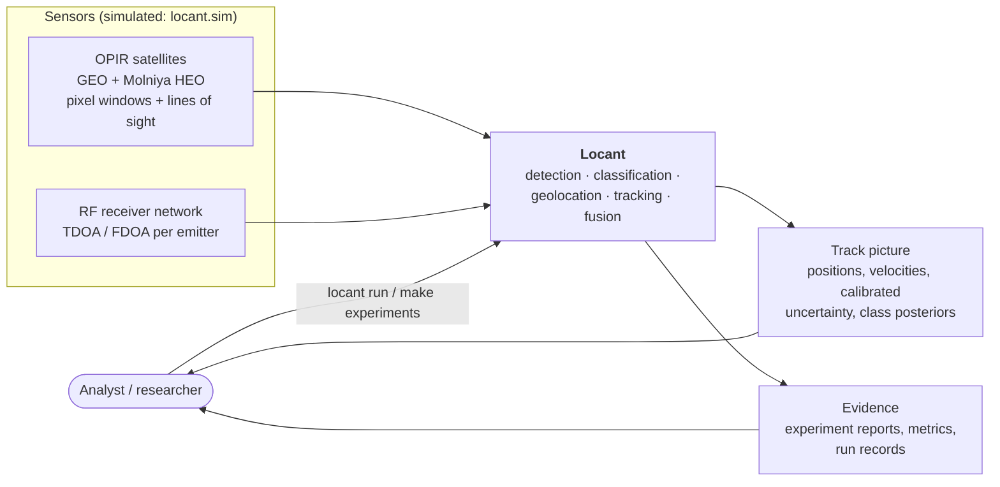
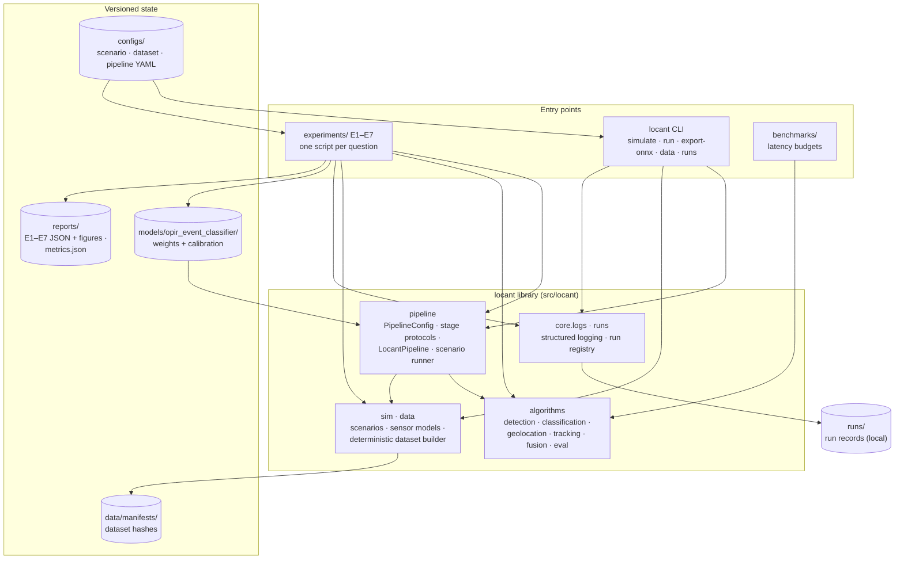
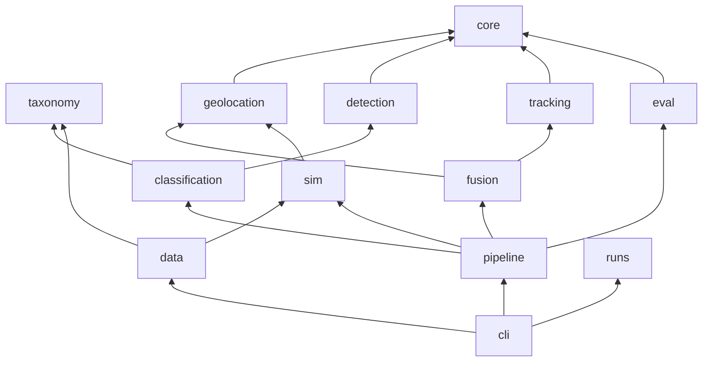
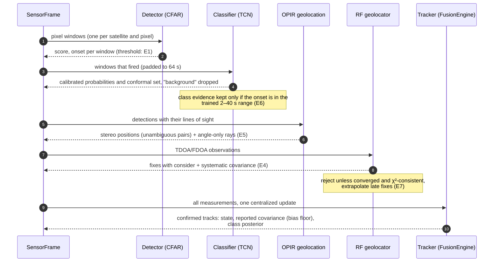
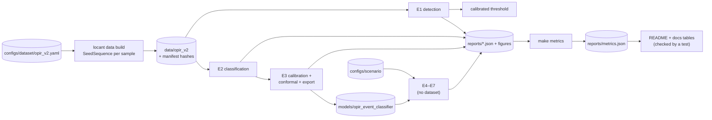

# Architecture

How Locant is put together: what it talks to, what runs inside it, how one
frame of sensor data flows through it, and how a result is reproduced. The
diagrams are [mermaid](https://mermaid.js.org/) and render on GitHub. The
package layering in §3 is enforced by `tests/unit/test_architecture.py`.

## 1. Context

Locant consumes two very different kinds of sensor product. OPIR gives a
radiometric time series per pixel plus the pixel's line of sight. The RF
network gives time and frequency differences of arrival per emitter. Locant
turns both into one track picture with calibrated uncertainty and calibrated
class labels. All sensor data is simulated by a physics-based simulator
([ADR 0003](adr/0003-synthetic-data-strategy.md)).

## 2. Containers

| Container | Responsibility | Key types |
|---|---|---|
| `locant.pipeline` | Orchestrates one frame through every stage; builds stages from configuration | `PipelineConfig`, `LocantPipeline`, `SensorFrame`, `FrameResult`, `run_scenario` |
| `locant.detection` | Window-level event detection at a calibrated false-alarm rate | `Detector` protocol, `CFARDetector`, `CUSUMDetector`, `StepGLRTDetector` |
| `locant.classification` | Calibrated classification, conformal sets, OOD scores; PyTorch and ONNX Runtime backends | `EventClassifier`, `OnnxEventClassifier`, `ModelArtifact` |
| `locant.geolocation` | TDOA/FDOA maximum likelihood, Chan-Ho, CRLB, DOP, systematic-error covariance | `solve_tdoa_fdoa`, `GeolocationResult`, `SystematicErrors` |
| `locant.tracking` | Kalman/EKF/IMM filtering, gating, assignment, track lifecycle, class posteriors, bias floor | `MultiTargetTracker`, `Track`, `Measurement` protocol |
| `locant.fusion` | OPIR line-of-sight geolocation, measurement conversion, fusion engine, T2T fusion | `FusionEngine`, `LineOfSightMeasurement`, `measurements_from_reports` |
| `locant.eval` | Detection, classification, calibration, and tracking metrics (GOSPA/OSPA) | `evaluate_tracking`, `gospa`, `expected_calibration_error` |
| `locant.sim`, `locant.data` | Scenario simulation and the deterministic, hashed dataset | `simulate_scenario`, `build_dataset` |
| `locant.runs`, `locant.core.logs` | Run registry and structured logging | `RunRegistry`, `log_event` |

## 3. Package layering

Arrows point from a package to what it imports. Every algorithm package also
imports `core` (linear algebra, χ² statistics, errors); those edges are
omitted for legibility. The rules:

- **Algorithms never import orchestration.** `core`, `geolocation`,
  `detection`, `tracking`, `eval`, and `fusion` know nothing about the
  pipeline, the CLI, the simulator, or the experiments. They can be reused
  or tested on their own.
- **The simulator depends only on measurement types.** `sim` imports
  `geolocation` for the receiver and TDOA/FDOA measurement types it
  produces, never the solvers.
- **Experiments live outside the package.** `experiments/` imports
  `locant`; nothing in `locant` imports `experiments`.

A new edge must be added to `ALLOWED` in `tests/unit/test_architecture.py`,
which makes every new dependency a reviewed decision.

## 4. One frame through the pipeline

- **One tracker update per frame.** All measurements are fused together.
  Updates are grouped by (source, dimension), so each satellite's rays and
  each kind of RF fix get their own χ² gate
  ([ADR 0001](adr/0001-fusion-architecture.md)).
- **Every threshold has a source.** Each number in the diagram is a field of
  `PipelineConfig`, and its documentation names the experiment that set it
  ([ADR 0002](adr/0002-configuration-cli-and-run-registry.md)).
- **Stages are replaceable.** Each stage is a protocol in
  `locant.pipeline.stages`. Tests replace the detector and classifier with
  doubles, and ONNX Runtime replaces PyTorch without touching the runner.

## 5. Reproducibility chain

- **The dataset is a pure function of its config and seed.** `make
  data-verify` rebuilds it and compares content hashes with the committed
  manifest.
- **Experiments own their numbers.** Each experiment writes a JSON report
  with confidence intervals. `make metrics` gathers the headline numbers
  into `reports/metrics.json` and regenerates every results table in the
  README and docs. `tests/regression/test_metrics_sync.py` fails if a table
  drifts from the reports.
- **Runs are recorded.** Every `locant run` and experiment launched from the
  command line writes `runs/<id>/run.json`: configuration and hash, seed,
  git commit (marked when the tree is dirty), package versions, timing,
  metrics, and artifacts.

## 6. Cross-cutting concerns

| Concern | Approach |
|---|---|
| **Randomness** | No global RNG: every stochastic function takes a `numpy.random.Generator`. Datasets and scenarios derive per-sample streams with `SeedSequence`. |
| **Units and frames** | SI units throughout; positions in a local ENU frame about a WGS-84 origin ([ADR 0006](adr/0006-frames-and-units.md)). |
| **Uncertainty** | Every estimate carries a covariance. Consistency is tested by NEES/NIS against χ² bounds, not assumed. |
| **Errors** | Typed exceptions (`GeometryError`, `InsufficientMeasurementsError`, `NotPositiveDefiniteError`), no silent placeholder values (v1 returned 999 or zeros). The pipeline counts and logs failures instead of raising. |
| **Configuration** | Frozen pydantic models; unknown keys fail at load. |
| **Logging** | `log_event(logger, level, "event_name", **fields)`; the CLI renders key=value lines or JSON. |
| **Performance** | Vectorized gating, stereo association, and geometry. Per-stage latency budgets run in CI (`make bench`). |
| **Quality gates** | ruff, strict mypy, 85% coverage gate on the library, Hypothesis properties, statistical tests (NEES/NIS, CRLB), characterization tests for every v1 defect ([audit](audit_v1.md)), metrics drift test, layering test. |
