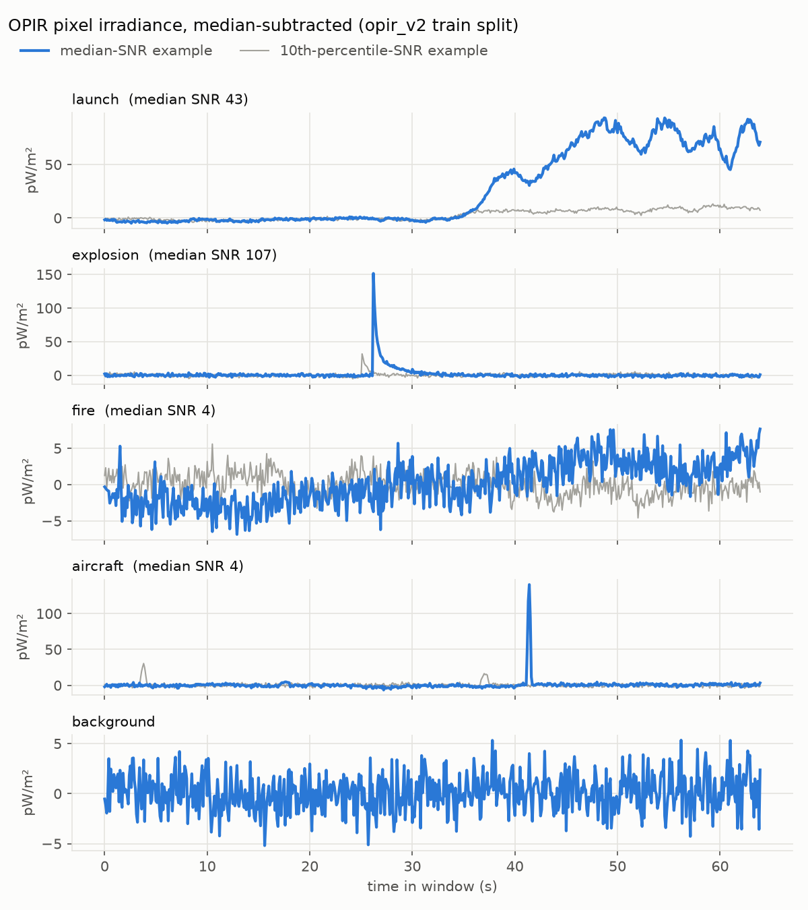
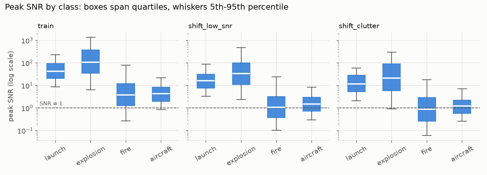

# Data card: `opir_v2`

Synthetic single-pixel OPIR time series for thermal-event classification.

| | |
|---|---|
| **Version** | 2.0.0 (`configs/dataset/opir_v2.yaml`) |
| **Manifest** | [`data/manifests/opir_v2.json`](../data/manifests/opir_v2.json): resolved config, per-split SHA-256 of array contents, class counts, SNR quantiles |
| **Build** | `make data` (about 20 s with 4 workers) · verify with `make data-verify` |
| **Size** | 30,000 samples, 640 frames each (64 s at 10 Hz), about 74 MB compressed |
| **Classes** | `launch`, `explosion`, `fire`, `aircraft`, `background` (order fixed by `locant.taxonomy.EVENT_CLASSES`) |
| **Provenance** | Fully simulated by `locant.sim`; no real sensor data |

## Intended use

- Training and evaluating detection and classification methods under controlled, known conditions.
- Measuring robustness to specific shifts (sensor noise, event physics, scene clutter) with held-out test sets.
- Demonstrating methodology. It is **not** for estimating how any real system performs.

All magnitudes (radiant intensities, noise levels, background levels) are order-of-magnitude and illustrative. They are unclassified, derived from public phenomenology, and do not describe any fielded sensor or vehicle.

## How a sample is generated

Each sample is one tracked pixel of a staring sensor on a geostationary satellite. The chain is in `locant.sim`:

1. **Site and geometry.** Site latitude is uniform in 0–60°, and longitude is within ±40° of the satellite's sub-satellite point. Range and viewing elevation follow from WGS-84 geometry.
2. **Event.** Event parameters are drawn from per-class priors (table below), giving a trajectory and a radiant-intensity time profile (W/sr). Launches fly a powered ascent with pitch-over (`BallisticBoost`), aircraft fly straight and level, and fires and explosions are stationary.
3. **Propagation.** Irradiance at the aperture is E = τ · I / R². Atmospheric transmittance τ depends on target altitude (8 km scale height) and the elevation of the line of sight, so a launch plume brightens as it climbs out of the atmosphere.
4. **Clouds.** In 40% of scenes an alternating clear/cloudy process attenuates targets below the cloud top by 2–30% transmittance. Launches that break out above the clouds show the characteristic step up in brightness.
5. **Optics.** A Gaussian PSF with sub-pixel phasing determines the fraction of energy in the tracked pixel. That fraction changes as moving targets cross the pixel grid, which scallops the signal.
6. **Background and noise.** The pixel also contains:
   - an Earth background of 100–400 pW/m²;
   - AR(1) clutter with 0.3–3 pW/m² RMS and 3–30 s correlation;
   - sun glints (in 30% of scenes): short half-sine pulses that look like explosions;
   - white noise-equivalent irradiance (NEI) of 0.5–2 pW/m².

Samples store the **measured** pixel irradiance in pW/m², with background included. Truth (signal, background, glint, occlusion, line of sight) is available from `locant.sim.opir.observe` when regenerating a sample.

*One median-SNR and one 10th-percentile-SNR training example per class, median-subtracted. The spike in the aircraft panel is a sun glint, not the aircraft: glints are a deliberate confuser for explosions.*

### Event priors

| Class | Key parameters (training ranges) |
|---|---|
| launch | peak 5e4–1e6 W/sr (log-uniform); 10–90% rise 1–5 s; burn 60–180 s; thrust 20–40 m/s²; flight-path elevation 30–70°; 50% two-stage; flicker 1–6% RMS; onset 2–40 s into the window |
| explosion | peak 2e5–2e7 W/sr (log); flash decay 0.05–0.5 s; fireball 5–30% of peak, decay 1–6 s; onset 2–40 s |
| fire | peak 1e5–3e6 W/sr (log); 10–90% growth 20–200 s; 5–30% fluctuation with 3–15 s correlation; onset 2–40 s |
| aircraft | 5e3–6e4 W/sr (log); altitude 3–13 km; 150–300 m/s; aspect modulation 5–30% over 20–80 s; 20% afterburner (2–6×); may already be in view when the window opens |
| background | no source; background, clutter, clouds, and glints only |

Full priors: `locant/data/config.py`. The manifest stores the resolved values for every split.

## Splits

Each sample's random stream is `SeedSequence(root_seed, spawn_key=(split, class, index))`. Splits therefore never share a sample, and a build does not depend on worker count or order. Classes are balanced in every split.

| Split | Samples | Purpose | Median peak SNR: launch / explosion / fire / aircraft |
|---|---|---|---|
| `train` | 15,000 | training | 43 / 107 / 3.9 / 4.3 |
| `validation` | 3,000 | model selection, calibration | 42 / 118 / 3.6 / 4.6 |
| `test` | 3,000 | in-distribution test | 42 / 94 / 3.0 / 3.9 |
| `shift_low_snr` | 3,000 | sensor degraded: NEI 2–8 pW/m² (4× training) | 16 / 34 / 1.1 / 1.5 |
| `shift_params` | 3,000 | event physics outside training ranges: 25–55 s burns, 0.3–1 s rises, 6–15 s fireballs, 5–20 s fire growth, 80% afterburner | 34 / 115 / 53 / 7.6 |
| `shift_clutter` | 3,000 | harsh scenes: clutter 3–10 pW/m², glints in 90% of scenes at 3–12/min, clouds in 90% | 12 / 21 / 0.9 / 1.3 |

Peak SNR is the peak in-pixel signal divided by √(NEI² + clutter²). Background samples have SNR 0.

## Known limitations and sim-to-real gap

- **One pixel, already tracked.** There is no detection on a focal plane, no neighboring pixels, and no track-before-detect. Spatial context that real systems use (plume shape, multi-pixel extent) is absent.
- **Simplified physics.** There is no spectral band model, no plume chemistry, no aspect-dependent plume shape, no Earth curvature or drag in boost, and the atmosphere is a single exponential. Radiant intensities are illustrative.
- **Stationary noise statistics.** Clutter is AR(1) Gaussian. Real Earth backgrounds are non-Gaussian and scene-dependent (coastlines, cloud edges).
- **Independent samples.** Each window holds at most one event and no revisits, so the dataset has no temporal correlation between samples.
- **Shift sets are designed, not observed.** They test robustness to shifts we chose. Performance on them bounds nothing about real-world shift.
- **Class priors are balanced.** Real base rates are extremely imbalanced (background dominates), so detection thresholds must be set with operational priors, not with this dataset's class frequencies.

## Reproducibility

- **Deterministic content.** The dataset is a pure function of the config, `root_seed`, and code version. `make data-verify` rebuilds it and compares per-split content hashes, which cover array contents, against the versioned manifest. File bytes are not hashed because `.npz` zip headers carry timestamps.
- **Platform caveat.** Hashes are reproducible on the same platform with the pinned numpy (2.5.3). Bit-exact equality across CPU architectures is not guaranteed, because vectorized transcendental functions can differ in the last unit of precision. The manifest records the environment that built it.
- **Changing the data.** Any change to priors, physics, or sampling must bump the dataset `version` and regenerate the manifest.

## Changes from v1

The v1 dataset (`data/synthetic/opir`, 10,000 `.npy` files) could not be regenerated from committed code (audit defect C3). Its classes were trivially separable, which is why v1 reported 100% test accuracy (C8). It contained no clouds, glints, clutter structure, geometry, or held-out shift sets. `opir_v2` replaces it. The v1 files remain on disk only for the legacy training scripts, which Phase 3 replaces.
