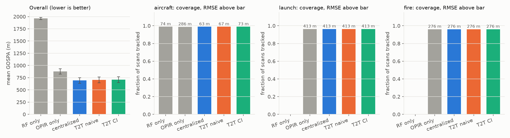
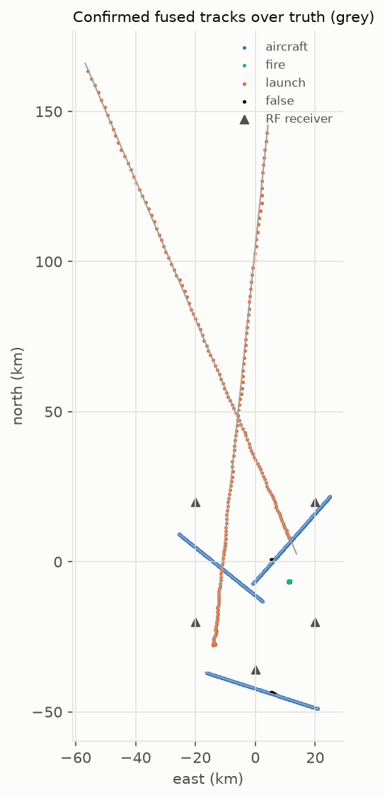
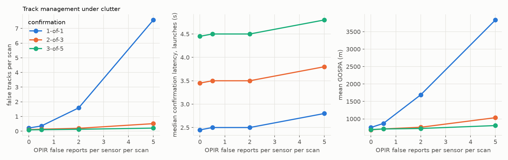
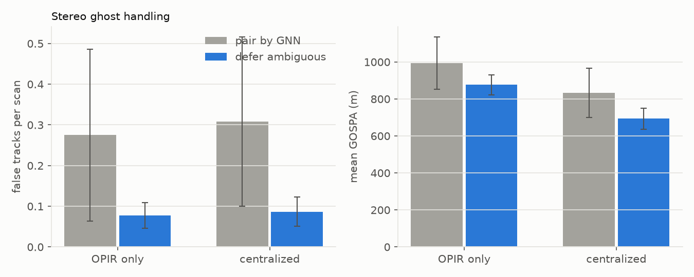
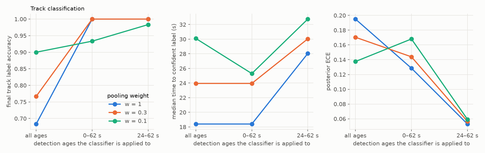
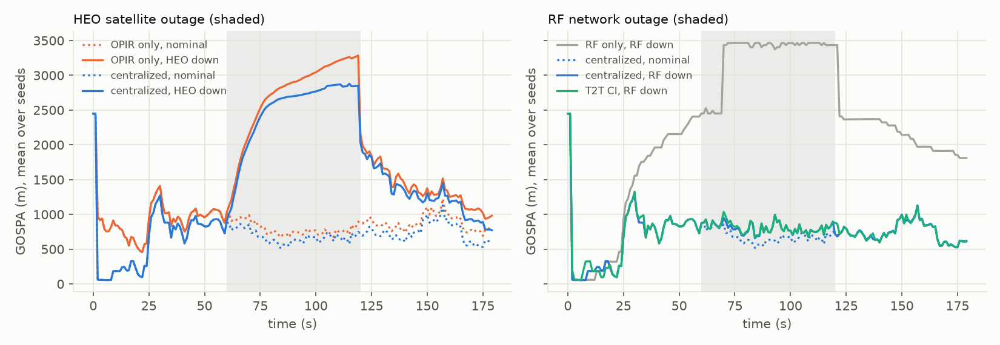
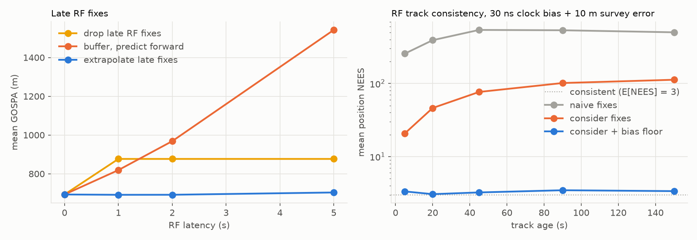

# Tracking and multi-INT fusion: methods and results

How Locant turns OPIR lines of sight and RF fixes into one track picture,
and what each design choice buys. Results come from experiments E5–E7
(`make e5 e6 e7`, about 20 min, no dataset needed). The full numbers, with
95% confidence intervals over 10 seeds, are in
[`reports/phase5/`](../reports/phase5/). The architecture decision is
recorded in [ADR 0001](adr/0001-fusion-architecture.md).

## Benchmark scenario

Each seed draws a 180 s scenario (`experiments/fusion_common.py`):

| Element | Configuration |
|---|---|
| Targets | 2 launches (boost 90–150 s), 3 aircraft at 8–11 km altitude, 200–250 m/s, each with a datalink, 1 ground fire |
| OPIR | GEO + Molniya HEO satellites, 1 Hz reports above SNR 5, 10 µrad line-of-sight noise |
| RF | 5 receivers over a 40 km area, 10 ns timing noise, 5 ns clock bias, 2 m survey error, FDOA at 1 Hz noise |

The truth set at each scan is every target that *any* sensor can see. A
single-sensor architecture is therefore charged for the targets only the
other sensor sees. That coverage question is exactly what fusion should
answer.

**Metrics.** GOSPA (α = 2, cutoff c = 2 km) decomposes into localization
error plus c²/2 per missed target and per false track; an estimate more than
2 km from every target counts as false. The other metrics are per-type
localization RMSE and coverage (the fraction of truth scans with a matched
confirmed track), confirmation latency, fragmentation and identity switches
from a per-scan truth-to-track assignment, and the NEES of matched tracks
(`locant.eval.tracking`).

## Methods

### OPIR geolocation (`locant.fusion.opir_geoloc`)

An OPIR detection is a unit line of sight **u** from a known satellite
position **s**, with angular noise σ per axis. It is used in three ways:

- **Line-of-sight update.** z = E·u(x) = 0, where E is a 2×3 basis
  perpendicular to the measured ray. The Jacobian is
  H = E (I − uuᵀ) / r, and the extended Kalman update runs in Joseph form.
  One ray cannot start a track because range is unobservable, but it can
  update any track.
- **Stereo triangulation.** Weighted least squares on two or more rays. It
  minimizes Σ ‖Pᵢ(x − sᵢ)‖² / (σᵢrᵢ)², where Pᵢ = I − uᵢuᵢᵀ, so the
  information is Σ Pᵢ / (σᵢrᵢ)². With GEO + HEO the error is about
  300–400 m, mostly along the shallow-angle direction.
- **Altitude intersection.** One ray meets a known altitude plane (for
  ground fires and launch pads). Implemented and tested, but not used in the
  benchmarks.

**Stereo association and ghosts.** A pair of rays from two satellites is
consistent if its normalized miss distance passes a χ²(1) gate. Two
satellites constrain a pair only within their epipolar plane, so rays from
*different* targets near a common epipolar plane also pass and triangulate to
a **ghost**. In the benchmark, global-nearest-neighbor pairing produced
224 ghosts among 8,595 pairs (2.6%). Locant keeps a pair only
if neither ray gates with any other ray. Ambiguous rays become line-of-sight
updates, which the tracker resolves against predicted tracks. This removed
every ghost and kept 89% of the correct pairs.

### Tracker (`locant.tracking`)

- **Measurement interface.** Every measurement provides
  `linearize(x) -> (h(x), H)` and, if it determines position,
  `initial_state()`. RF fixes (position, or position and velocity with
  cross-covariance), stereo positions, and lines of sight share one update
  path.
- **Association.** Measurements are grouped by (source, dimension), with
  each OPIR satellite its own source. Each group is gated on the NIS against
  χ²(dim) at 0.99 and assigned by GNN, so a track can take a ray from each
  satellite and an RF fix in the same scan.
- **IMM.** A quiet (q = 25 m²/s³) and a maneuvering (q = 1600 m²/s³)
  constant-velocity model, with mean sojourn times of 60 s and 10 s. Gating
  uses the smallest NIS over the modes, so a maneuver can be gated by the
  model that predicts it.
- **Track management.**
  - Confirmation is M-of-N (default 3 of 5); only confirmed tracks are
    reported.
  - A track is deleted after 10 s without an update.
  - Duplicate tracks on one target, which alternate in claiming its single
    measurement, are merged when their positions agree at χ²(3) = 0.9 under
    the summed covariance.
- **Reported covariance.** A measurement can carry the systematic part of
  its covariance, an error shared by every measurement from that sensor
  (RF network bias). The track keeps it as a bias floor and reports filter
  covariance + floor (`Track.reported`). Gating and merging use the filter
  covariance (details under the E7 bias results).
- **Class posterior.** Each OPIR measurement can carry calibrated classifier
  probabilities (E3). They are pooled log-linearly into the track posterior:
  log π ← log π + w·(log p − log prior), with tempering weight w ≤ 1.

### Track-to-track fusion (`locant.fusion.t2t`)

Separate OPIR and RF trackers; their confirmed tracks' *reported* estimates
(including any RF bias floor) are paired by a χ²(3) gate on the summed
position covariance and GNN. Matched pairs are fused either
**naively**, as if independent, P = (P₁⁻¹ + P₂⁻¹)⁻¹, or by **covariance
intersection**, P⁻¹ = ωP₁⁻¹ + (1−ω)P₂⁻¹ with ω chosen to minimize tr P. CI
is consistent for any unknown cross-correlation. A unit test shows the naive
rule's NEES exceeds its χ² bound under correlated errors, while CI stays
within it.

## Results

### Architectures (E6)

<!-- metrics:fusion_architectures -->
| Architecture | GOSPA (m) | False tracks / scan | Aircraft RMSE | Launch RMSE | Fire RMSE | NEES | Identity switches per run |
|---|---|---|---|---|---|---|---|
| RF only | 1,961 [1,938, 1,985] | 0.00 | 74 m | not seen | not seen | 3.2 | 0.0 |
| OPIR only | 877 [822, 931] | 0.08 | 286 m | 413 m | 276 m | 2.7 | 0.3 |
| **Centralized** | 693 [637, 749] | 0.09 | 63 m | 413 m | 276 m | 3.1 | 0.3 |
| T2T naive | 689 [638, 741] | 0.09 | 53 m | 413 m | 276 m | 3.1 | 1.9 |
| T2T CI | 692 [640, 744] | 0.09 | 57 m | 413 m | 276 m | 3.1 | 1.9 |
<!-- /metrics:fusion_architectures -->

Reported covariances include the RF bias floor (below). Track-to-track (T2T)
fusion combines the trackers' *reported* estimates, which is what a
distributed node would transmit.

- **Fusion is mostly about coverage.** RF never sees the launches or the
  fire. OPIR sees everything, but places aircraft about 4× worse than RF (286 m vs 74 m).
  Centralized fusion gets both.
- **Aircraft accuracy improves** (74 → 53–63 m), although OPIR stereo is
  about 4× less precise than RF. The gain is largest where the RF geometry
  is weak, with aircraft outside the receiver network.
- **T2T now places aircraft better than centralized fusion** (53 m vs 63 m).
  The cause is the RF bias. The centralized filter treats every biased RF fix
  as independent, so it trusts its RF information more than it should and
  gives OPIR too little weight. A T2T fusion of *reported* estimates sees
  the RF track's bias floor and weights OPIR correctly. Overall GOSPA is the
  same within its confidence interval. The principled fix for centralized
  fusion is to estimate the bias in the filter (a Schmidt-Kalman or
  augmented-state filter), which is listed as a stretch item.
- **T2T still churns identity.** Pairing tracks after the fact switches
  identities about 6× as often (1.9 vs 0.3 per run). It also cannot use
  single-satellite rays (the RF outage results below).
- **Every architecture is consistent** (NEES 2.7–3.2 against 3) once the
  library carries the RF bias floor. Before Phase 6, every RF-fed
  architecture reported NEES 10–16.

### Track management under clutter (E5)

OPIR false reports are injected uniformly over a 120 km square, at 0–5 per
satellite per scan.

<!-- metrics:track_management -->
| Clutter rate | 1-of-1: false tracks/scan, GOSPA | 2-of-3 | 3-of-5 |
|---|---|---|---|
| 0 | 0.21, 754 m | 0.11, 685 m | 0.09, 693 m |
| 2 | 1.59, 1,691 m | 0.19, 760 m | 0.13, 725 m |
| 5 | 7.58, 3,836 m | 0.51, 1,035 m | 0.21, 808 m |
<!-- /metrics:track_management -->

Each extra required hit costs about 1 s of confirmation latency (median for
launches: 2.5 s, 3.5 s, and 4.5 s). Clutter does little to 2-of-3 and 3-of-5
because a random ray from one satellite rarely pairs stereo-consistently
with one from the other, so clutter seldom starts a track. 3-of-5 is the
default.

**Stereo ghosts.** Deferring ambiguous pairs cuts false tracks per scan
from 0.31 to 0.09 (centralized) and GOSPA from 832 to 693 m. The cost is
slower launch initiation, with median latency rising from 2.3 to 4.5 s.

**Motion model.**

<!-- metrics:motion_model -->
| Model | GOSPA | Launch RMSE | Launch coverage | Identity switches |
|---|---|---|---|---|
| Constant velocity, q = 25 | 1,404 m | 747 m | 64% | 8.5 |
| Constant velocity, q = 400 | 889 m | 522 m | 92% | 2.6 |
| **IMM (q = 25 / 1600)** | 693 m | 413 m | 96% | 0.3 |
<!-- /metrics:motion_model -->

No single process noise suits both cruising aircraft and boosting launches.
The quiet model loses launches, and the noisy one blurs everything else.

### Track classification (E6)

The exported TCN classifies each OPIR report's 64 s window. Two choices
matter: the pooling weight w, and which windows the classifier is applied to.
The classifier was trained on windows with the event onset 2–40 s in, that
is, windows ending 24–62 s after onset. Later windows no longer contain the
onset, and a boosting plume then looks like a steady source, so launches
drift to "aircraft".

<!-- metrics:track_classification -->
| Windows used (detection age) | w | Final label accuracy | Posterior ECE | Median time to confident label |
|---|---|---|---|---|
| all ages | 1 | 68% | 0.20 | 18 s |
| all ages | 0.3 | 77% | 0.17 | 24 s |
| 0–62 s | 1 | 100% | 0.13 | 18 s |
| 0–62 s | 0.3 | 100% | 0.14 | 24 s |
| **24–62 s (trained range)** | 1 | 100% | 0.05 | 28 s |
| **24–62 s (trained range)** | 0.3 | 100% | 0.06 | 30 s |
<!-- /metrics:track_classification -->

"Confident" means a true-class probability of at least 0.9. ECE is computed
over every scan at which a matched track has a posterior.

- **The domain of validity matters more than the pooling rule.** Restricting
  the classifier to the windows it was trained on fixes the final labels and
  cuts calibration error about 3×, at the cost of about 6 s to the first
  confident label.
- **The tempering weight matters little inside the trained domain.** Its
  role is robustness: with w = 1, out-of-domain evidence (all ages) drives
  wrong labels to certainty. The default is w = 0.3 with the trained range.
- **The pipeline applies the same rule** using the CFAR onset estimate:
  class evidence reaches a track only if the detected onset lies 2–40 s
  into the window (`CLASSIFIER_ONSET_RANGE_S`).

### Robustness (E7)

**Sensor outages**, during 60–120 s:

<!-- metrics:outages -->
| Outage | Architecture | GOSPA during | Aircraft coverage | Launch coverage | Fragmentations per run |
|---|---|---|---|---|---|
| none | centralized | 682 m | 100% | 97% | 0.0 |
| HEO satellite | OPIR only | 2,696 m | 100% | 23% | 1.9 |
| HEO satellite | centralized | 2,476 m | 100% | 23% | 1.8 |
| RF network | RF only | 3,284 m | 17% | – | 3.0 |
| RF network | centralized | 802 m | 100% | 97% | 0.0 |
| RF network | T2T CI | 812 m | 100% | 97% | 0.0 |
<!-- /metrics:outages -->

- **An RF outage is absorbed.** OPIR stereo positions and lines of sight
  keep every aircraft track, with RMSE rising from 64 m to 217 m, and RF
  re-acquires the tracks without fragmentation.
- **A satellite outage is not.** With one satellite there is no stereo, so
  OPIR cannot start tracks, and angle-only updates leave range unobserved.
  Existing launch tracks drift in range, which shows up as false and missed
  targets. RF still holds the aircraft (71 m). The remedies are a third
  satellite, altitude-constrained initiation for ground events, or a boost
  dynamics model.

**RF latency.** RF fixes arrive L seconds late, after newer OPIR scans.

<!-- metrics:latency -->
| Latency | Drop late fixes | Buffer and predict forward | Extrapolate late fixes |
|---|---|---|---|
| 0 s | 693 m | – | – |
| 1 s | 877 m | 819 m | 692 m |
| 2 s | 877 m | 968 m | 692 m |
| 5 s | 877 m | 1,542 m | 704 m |
<!-- /metrics:latency -->

All values are GOSPA.

- **Dropping** discards all RF, because at 1 Hz OPIR every late fix is out
  of sequence.
- **Buffering** keeps the tracker in time order but delays the whole picture
  by L, which hurts the accelerating launches most.
- **Extrapolating** propagates each fix to the current time with its own
  FDOA velocity (z′ = Fz, R′ = FRFᵀ + Q). It loses nothing up to 2 s.
  Aircraft RMSE grows from 64 m to 94 m at 5 s.

**Time-correlated RF bias.** Clock bias and survey error are fixed for a
scenario. The consider covariance (E4) makes each *fix* consistent, but the
tracker averages many fixes from the same biased network as if their errors
were independent. Its covariance shrinks toward zero while the bias stays.

<!-- metrics:rf_bias -->
| 30 ns clock bias + 10 m survey | NEES, track age 0–10 s | 30–60 s | 120–180 s |
|---|---|---|---|
| naive fixes | 246 | 519 | 469 |
| consider fixes, filter covariance | 21 | 77 | 113 |
| **consider fixes, reported covariance (with bias floor)** | 3.8 | 3.4 | 3.5 |
<!-- /metrics:rf_bias -->

**How the library carries the bias floor:**

1. The solver returns the first-order systematic part of each fix's
   covariance, A Σ_sys Aᵀ with A = P Jᵀ C⁻¹
   (`GeolocationResult.systematic_covariance`). For TDOA it equals k/(1+k) of
   the consider covariance, k = σ_sys²/σ_toa², because clock bias and survey
   error share the random noise's (I + 11ᵀ) structure. A unit test checks
   this, and a Monte Carlo test checks it against bias-only errors.
2. The RF measurement carries that systematic part to the track
   (`Track.bias_floor`).
3. Tracks report filter covariance + floor (`Track.reported`). Gating and
   duplicate merging still use the filter covariance, because two tracks
   sharing a bias do not differ by it.

This restores consistency at every track age. At the default 5 ns / 2 m
levels, NEES drops from 7.5–19 to 2.6–3.4. The floor is conservative for very
young tracks: it double-counts the bias at the first fix, and that excess
fades as 1/n. Fixes solved without systematic levels carry no floor and stay
overconfident. That is why the deployed configuration sets the network's
levels.

## Limits

- **Simulated reports.** OPIR reports are generated per event, at a fixed
  10 µrad noise, from the simulator's pixel signals. Focal-plane detection,
  centroiding, and pixel-level clutter tracking are not modeled; the
  detection age used to gate the classifier stands in for a focal-plane
  tracker's 2-D track age.
- **GNN, not JPDA or MHT.** Hard assignment is adequate at these target
  densities. Crossing targets would need soft association.
- **Launch dynamics.** Launches are tracked with constant-velocity models,
  which explains the 413 m launch RMSE. A boost model, or IMM with a
  constant-acceleration mode, is a stretch item.
- **Bias floor, not bias estimation.** The floor is the latest fix's
  systematic covariance and assumes the bias stays fixed over a track's
  life. It makes reported uncertainty honest, but it does not let the
  centralized filter weight RF and OPIR correctly (T2T beats centralized on
  aircraft for that reason). Estimating the bias states (Schmidt-Kalman) is
  the principled extension.
