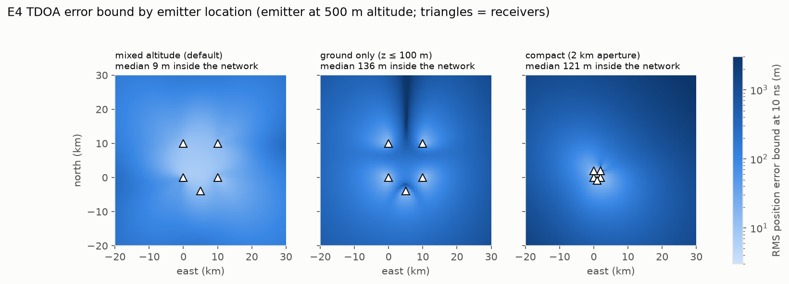
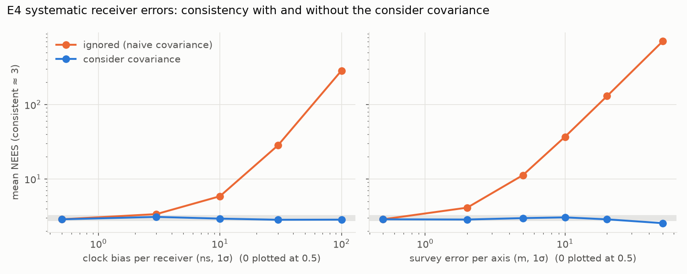

# RF geolocation: methods and results

How SENTINEL locates RF emitters from time and frequency differences of
arrival, what accuracy is achievable, and how the estimators behave when real
error sources are present. Results come from experiment E4
(`make e4`, about 10 s, no dataset needed). The full numbers are in
[`reports/phase4/e4_geolocation.json`](../reports/phase4/e4_geolocation.json).

## Measurement model

Receivers i = 0..N-1 at known positions sᵢ (and velocities ṡᵢ) observe an
emitter at position x with velocity v. With range rᵢ = ‖x - sᵢ‖ and line of
sight uᵢ = (x - sᵢ)/rᵢ, the reference-sensor measurements are:

| Quantity | Model | Units |
|---|---|---|
| TDOA | dₖ = rₖ - r₀ (range difference), reported as dₖ / c | s |
| FDOA | ḋₖ = uₖᵀ(v - ṡₖ) - u₀ᵀ(v - ṡ₀) (range-rate difference), reported as -(f_c / c) ḋₖ | Hz |

Each receiver has an independent timing error with standard deviation σ. The
reference error is shared by every difference, so the differences are
correlated, with covariance R = (cσ)²(I + 11ᵀ). v1 treated all N(N-1)/2 pairs
as independent. That overcounts information and makes the reported covariance
optimistic. SENTINEL uses the N-1 reference differences with the full R.

## Estimators

- **Chan-Ho** (`chan_ho`): two-stage closed form (Chan & Ho 1994). Stage 1 solves pseudo-linear equations in [x - s₀, r₀] by weighted least squares; stage 2 enforces r₀² = ‖x - s₀‖². It needs at least 5 receivers. Stage 2 is skipped when any stage-1 coordinate is within 3σ of zero, because its linearization fails there.
- **ML** (`solve_tdoa`, `solve_tdoa_fdoa`): Levenberg-Marquardt on the whitened residual R^(-1/2)(z - h(θ)) with analytic Jacobians, initialized by Chan-Ho. It reports covariance (Hᵀ R⁻¹ H)⁻¹ at the estimate. It raises `GeometryError` when the Jacobian is rank-deficient, for example velocity without FDOA, or too few receivers.

## Cramér-Rao bound

For Gaussian measurements, the Fisher information is J(θ) = Hᵀ R⁻¹ H, with
H = ∂h/∂θ evaluated at the truth. Any unbiased estimator satisfies
Cov(θ̂) ⪰ J⁻¹. For TDOA, the rows of H are uₖ - u₀. Because R has the
(I + 11ᵀ) structure, the bound is the same for every choice of reference
receiver, and it equals (cσ · GDOP)² in trace. For joint TDOA/FDOA, H stacks
the range-difference rows (position only) and the range-rate rows (position
and velocity), and R is block diagonal (`tdoa_crlb`, `tdoa_fdoa_crlb`).

## Systematic receiver errors: consider covariance

Clock bias bᵢ and survey error eᵢ are fixed per receiver over a scenario and
unknown to the solver. To first order, they perturb the range differences by

- c(bₖ - b₀) for clock bias, with covariance (cσ_b)²(I + 11ᵀ);
- -uₖᵀeₖ + u₀ᵀe₀ for survey error. For isotropic per-axis error σ_p this has covariance σ_p²(uₖᵀuₖ δₖₗ + u₀ᵀu₀) = σ_p²(I + 11ᵀ), because the u are unit vectors.

Both have the same structure as the random timing noise and do not depend on
geometry. `SystematicErrors` adds (σ_b² + σ_p²/c²)(I + 11ᵀ) to the TDOA
covariance before solving (Schmidt's consider covariance). The same applies to
local-oscillator offsets for FDOA.

## Results (E4)

**The ML estimator attains the bound.** Five-receiver mixed-altitude network,
emitter inside the network, 500 Monte Carlo runs per point:

| Timing noise σ | CRLB RMS | ML RMSE | ML mean NEES | Chan-Ho RMSE |
|---|---|---|---|---|
| 1 ns | 0.83 m | 0.81 m | 2.84 | 2.57 m |
| 10 ns | 8.29 m | 8.05 m | 2.90 | 25.5 m |
| 100 ns | 82.9 m | 81.8 m | 2.95 | 278 m |
| 300 ns | 249 m | 270 m | 3.14 | 866 m |

The ML RMSE tracks the CRLB to within 3% up to 100 ns. At 300 ns (90 m of
range noise) it is 9% above the bound, where nonlinearity starts to matter.
NEES stays within its 95% band (2.79–3.22), so the reported covariance is
trustworthy. Chan-Ho is about 3× worse on this network. Its vertical
coordinate is poorly determined (VDOP ≈ 8), so stage 2 is mostly skipped.
On well-spread ring networks of 5–12 receivers, Chan-Ho is within ±4% of
the bound (Monte Carlo resolution).

**Geometry dominates accuracy.** Median RMS error bound at 10 ns for emitters
inside the network: 9 m with mixed-altitude receivers, 136 m with ground-only
receivers (vertical poorly observable), and 121 m with a 2 km-aperture compact
network. Outside the network the bound grows quickly in every case.

**Unmodeled systematic errors make the covariance overconfident.** Timing noise
is 10 ns in all rows.

| Systematic error | RMSE | Reported RMS (naive) | NEES naive | NEES consider |
|---|---|---|---|---|
| none | 7.9 m | 8.3 m | 2.9 | 2.9 |
| clock bias 30 ns | 25.5 m | 8.3 m | 28.3 | **2.83** |
| clock bias 100 ns | 84.3 m | 8.3 m | 286 | **2.84** |
| survey error 20 m | 53.4 m | 8.3 m | 130 | **2.86** |
| survey error 50 m | 131 m | 8.3 m | 710 | **2.54** |

Ignoring a 100 ns clock bias leaves the reported uncertainty 10× too small.
The consider covariance restores consistency at every level tested.

**Joint TDOA/FDOA attains its velocity bound.** With moving receivers, 10 ns
timing noise, and 1 Hz frequency noise at 1 GHz, velocity RMSE is 0.80 m/s
against a bound of 0.83 m/s. Mean NEES over the 6-D state is 5.8 (95% band
5.6–6.4). Velocity error scales linearly with frequency noise (0.26 m/s at
0.3 Hz, 8.7 m/s at 10 Hz).

## Limits

- **Weak vertical geometry is nonlinear.** With ground-only receivers and an emitter at 500 m altitude, the RMSE is 870 m against a reported 226 m even with no systematic errors. The median NEES is 4.0 but the mean is 37, because a few fits land far off. First-order covariances, including the consider covariance, are not valid in this regime. Remedies are better geometry (an elevated receiver), an altitude constraint (terrain or a known flight level), or a multimodal estimator.
- **Biases are constant within a scenario.** The consider covariance is correct over network realizations. Fusing many scans from the *same* network does not average the bias down, so a tracker must model it as correlated across time. This feeds into Phase 5 fusion.
- **Simulated measurements.** TDOAs and FDOAs are simulated directly from geometry. Estimating them from waveforms by cross-ambiguity is a stretch item; the baseband waveforms and delay/Doppler operators are already in `sentinel.sim.rf`.
