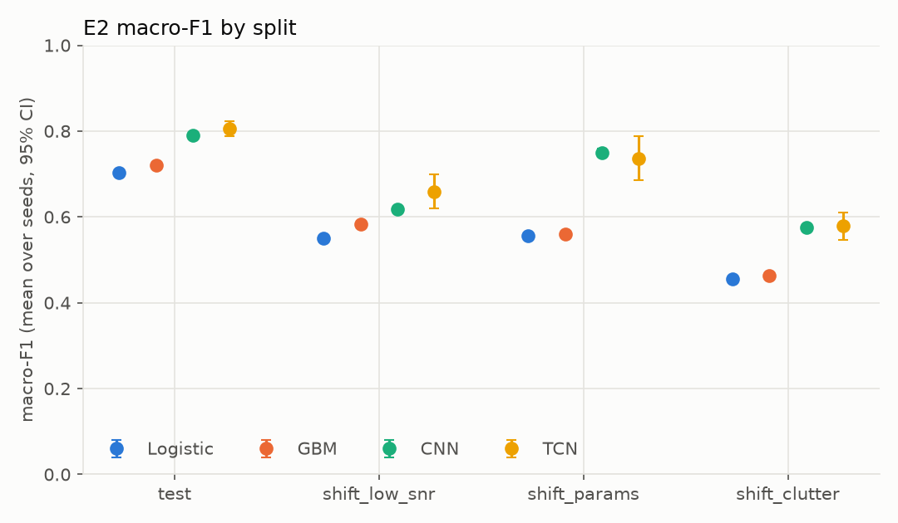
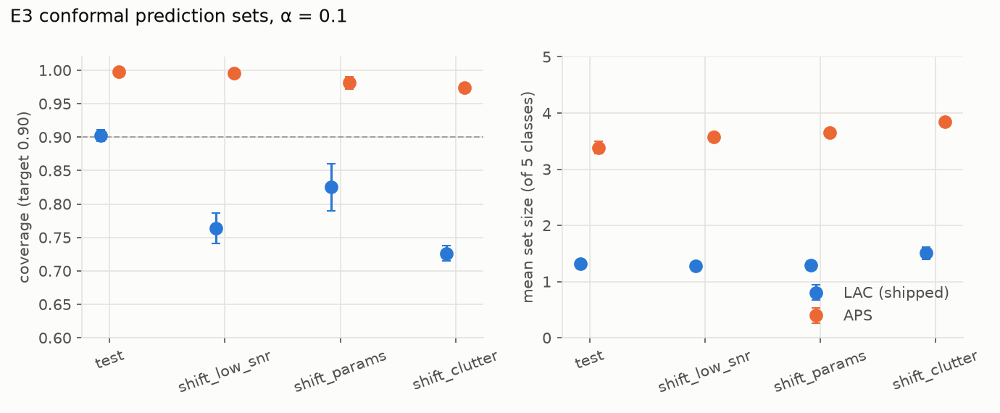

# Model card: `opir_event_classifier`

Temporal convolutional network that classifies a 64 s OPIR pixel window into
`launch`, `explosion`, `fire`, `aircraft`, or `background`, with calibrated
probabilities and a conformal prediction set.

| | |
|---|---|
| **Artifact** | [`models/opir_event_classifier/`](../models/opir_event_classifier/): `weights.pt` (state dict, loaded with `weights_only=True`) + `artifact.json` (architecture, preprocessing, class order, temperature, conformal threshold, dataset hash, training config, metrics) |
| **Load** | `EventClassifier.load("models/opir_event_classifier")` |
| **Produced by** | `make experiments` (E2 trains and selects; E3 calibrates and exports) |
| **Training data** | `opir_v2` train split, 15,000 simulated windows ([data card](data_card.md)), config hash recorded in the artifact |
| **Reports** | [`reports/phase3/`](../reports/phase3/): `e1_detection.json`, `e2_classification.json`, `e3_uncertainty.json` and figures |

## Intended use

Second stage of a two-stage OPIR alarm chain: a CFAR detector raises alarms at
a calibrated false-alarm rate, and this classifier labels the alarm or rejects
it as background (most often a sun glint). Its outputs are a label, calibrated
probabilities, and a set of plausible labels.

**Not for** operational use, real sensor data, or any claim about real-world
performance. The model has only ever seen simulated data with illustrative
magnitudes. See the data card's sim-to-real section.

## Model

- **Architecture:** causal TCN with 7 residual blocks, 32 channels, kernel 3, dilations 1–64 (receptive field 509 frames ≈ 51 s), global average + max pooling, linear head. 42k parameters.
- **Input:** raw pixel irradiance (pW/m²), 640 frames at 10 Hz. Preprocessing (stored in the artifact): subtract the 10th-percentile baseline, divide by white-noise σ estimated from first differences, asinh.
- **Training:** AdamW (lr 3e-3, weight decay 1e-2), one-cycle schedule, batch 128, up to 40 epochs with early stopping on validation loss, random time shift (±10%) and ±10% gain augmentation. Seed 3 of 5; the best validation loss came at epoch 39 of 40, so a larger budget may help.
- **Selection:** TCN chosen over CNN, gradient-boosted trees, and logistic regression by mean validation macro-F1 over seeds (E2). The exported seed has the best validation macro-F1 of the five TCN seeds.

## Performance (E2)

Macro-F1 over the five classes. "Seeds" is the mean over five training seeds
with a 95% t-interval; the exported model's test value carries a bootstrap CI.

| Split | Exported model | TCN, 5 seeds | Best baseline (GBM) |
|---|---|---|---|
| test | **0.815** [0.803, 0.827] | 0.806 [0.788, 0.824] | 0.720 |
| shift_low_snr | 0.677 | 0.659 | 0.584 |
| shift_params | 0.754 | 0.737 | 0.560 |
| shift_clutter | 0.597 | 0.579 | 0.463 |

Per-class test F1: launch 0.97, explosion 0.98, aircraft 0.74, fire 0.70,
background 0.69. Fires and aircraft are faint (median SNR ≈ 4), so their errors
are mostly confusion with background. Event recall by peak SNR: 0.30 below 2,
0.71 at 2–5, 0.94 at 5–20, 0.98 at 20–100, 1.00 above 100.

## Calibration and prediction sets (E3)

Temperature scaling was fit on validation (T = 1.10 for the exported seed).
The network was already well calibrated in-distribution, so scaling changes
little; calibration degrades under shift either way.

| Split | ECE before → after (5 seeds) | Conformal coverage, α = 0.1 | Mean set size | Singleton sets |
|---|---|---|---|---|
| test | 0.020 → 0.019 | **0.902** [0.894, 0.911] | 1.32 | 71% |
| shift_params | 0.087 → 0.086 | 0.825 | 1.29 | 74% |
| shift_low_snr | 0.128 → 0.119 | 0.764 | 1.28 | 74% |
| shift_clutter | 0.131 → 0.121 | 0.726 | 1.51 | 55% |

- **Method: LAC** (Sadinle, Lei & Wasserman 2019; set = labels with p ≥ 1 - q̂, q̂ = 0.764). The first E3 run used non-randomized APS, and its threshold came out at q̂ ≈ 1.0. That method gives valid but uninformative sets: coverage 0.998 with 3.4 of 5 labels per set. With a confident model that is wrong about 20% of the time, APS scores of misclassified windows sit just below 1. APS is still reported for comparison (`aps_*` fields).
- **The guarantee is marginal and exchangeable-only.** Per-class test coverage ranges from 0.82 (aircraft, fire) to 0.97 (launch, explosion). Class-conditional (Mondrian) conformal would equalize it at the cost of larger sets. Under shift, coverage falls well below the target, so sets calibrated on the training distribution must not be trusted after a sensor or scene change.

## Two-stage alarm performance (E1 + E3)

Measured on 20,000 independent background windows (E1's evaluation stream)
and the 2,400 test events. The CFAR threshold (5.27) gives a 1% false-alarm
rate on glint-free background.

| | False alarms, all background | False alarms, glint scenes | Pd (events) |
|---|---|---|---|
| CFAR only | 23.9% | 96.2% | 66.3% |
| CFAR + classifier (alarm unless labeled background) | **5.6%** | 21.6% | 63.1% |

The classifier rejects about 78% of the glint alarms at a cost of 3 points of
detection probability; 60.7% of events are both detected and correctly
labeled. Of the 1,127 residual false alarms, 92% are glint scenes, and the
classifier labels them aircraft (46%) or fire (44%), not explosion (2%). The
faint, slow classes are where the background boundary is weakest, which matches
their per-class F1.

## Out-of-distribution behavior (E3)

Leave-one-event-class-out: retrain on four event classes plus background, then
ask whether energy or max-softmax scores separate the held-out class from the
known ones (AUROC; 0.5 is chance).

| Held-out class | AUROC energy | AUROC max-softmax |
|---|---|---|
| aircraft | 0.79 | 0.81 |
| fire | 0.71 | 0.76 |
| launch | 0.40 | 0.52 |
| explosion | 0.38 | 0.52 |

Faint novel events are partly detectable, but **bright novel events are not**.
An unseen launch or explosion produces large logits and gets assigned
confidently to a known class, and energy scores rank it as *more* familiar than
real known samples. Softmax- or logit-based OOD scores are therefore not a
safeguard against new bright event types. Feature-space methods (Mahalanobis,
density models) or explicit "unknown" training data are the next step.

## Limitations

- **Simulation only.** Single tracked pixel, simplified physics, Gaussian clutter, illustrative magnitudes. Real-data performance is unknown.
- **Distribution shift degrades everything.** Macro-F1 falls from 0.81 to 0.60 in harsh clutter, and conformal coverage loses its guarantee off-distribution (see E3).
- **Novel bright events are not flagged.** Energy and max-softmax scores do not detect unseen launch- or explosion-like events (see E3).
- **Balanced classes.** Training and test priors are uniform; deployment base rates are dominated by background, so thresholds must be set with operational priors.
- **MPS training.** Trained on Apple MPS; bit-exact retraining is guaranteed only on CPU. MPS retraining reproduces the metrics within seed variance.
