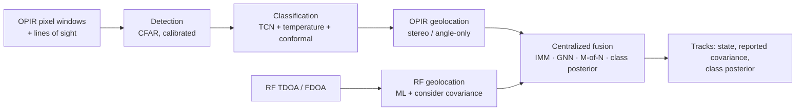
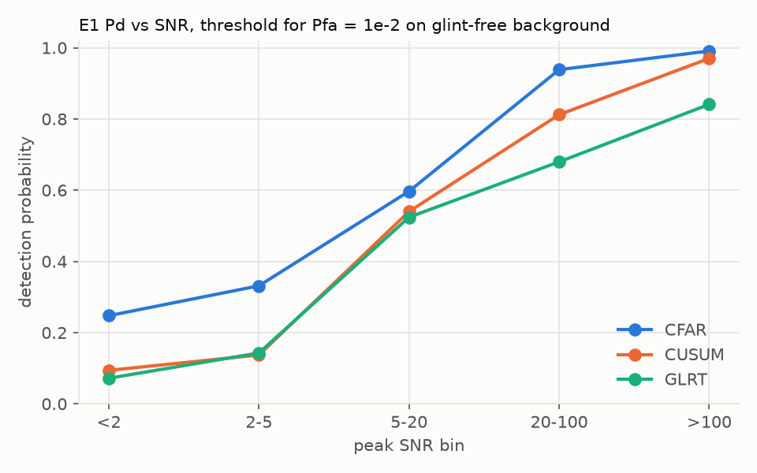
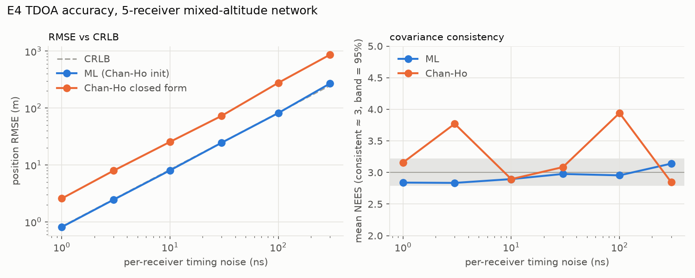

# Locant: technical report

*Multi-sensor detection, classification, geolocation, and tracking for
overhead persistent infrared (OPIR) and RF sensors.*

**Abstract.** Locant fuses two complementary sensors.
- **OPIR satellites** see every hot event (launches, fires, explosions,
  aircraft) but measure only a direction.
- **RF receiver networks** measure position and velocity to tens of metres,
  but only for targets that emit.

The system covers the whole chain: detection at a calibrated false-alarm
rate, a calibrated deep classifier with conformal prediction sets,
maximum-likelihood TDOA/FDOA geolocation that attains its Cramér-Rao bound,
OPIR line-of-sight geolocation, and IMM tracking with centralized fusion.
Every stage is evaluated in seven experiments with confidence intervals. On
a multi-target benchmark, fusion cuts the GOSPA tracking error by 21% against
OPIR alone and 65% against RF alone, and tracks targets neither sensor covers
on its own. Track uncertainty is statistically consistent (NEES ≈ 3) once a
time-correlated RF bias is carried as a covariance floor. The work also
reports where the methods fail: under domain shift, for bright novel events,
with one satellite lost, and for centralized fusion under correlated RF error.
All data is simulated ([§3](#3-data)), so the results measure methodology,
not fielded performance.

**Contents.** [1 Problem](#1-problem) · [2 System](#2-system) ·
[3 Data](#3-data) · [4 Methods](#4-methods) ·
[5 Results](#5-experiments-and-results) · [6 Engineering](#6-engineering) ·
[7 Limitations](#7-limitations) · [8 Future work](#8-future-work) ·
[9 Reproducing](#9-reproducing-the-results)

## 1. Problem

A missile launch, a wildfire, a large explosion, and a jet at altitude all
appear to a staring infrared satellite as one pixel whose brightness changes
over time. The satellite reports *that* something happened and *where it
looks*, but not how far away it is. An RF network that hears an emitter
(a radar, a datalink) can triangulate its position and velocity from time
and frequency differences of arrival, but it is blind to anything that does
not transmit.

An operator wants one picture: each object, where it is, how sure we are,
and what it is. That raises five problems:

- **Detect** events against cluttered background at a known false-alarm
  rate.
- **Classify** them with honest confidence, including outside the
  conditions seen in training.
- **Locate** emitters as precisely as the geometry allows, with a
  trustworthy covariance.
- **Associate and fuse** OPIR directions with RF fixes into tracks, without
  counting information twice.
- **Stay calibrated** when sensors fail, data arrives late, or the RF
  network carries a fixed bias.

## 2. System



Each stage is a protocol with a default implementation, built from one
validated configuration (`configs/pipeline/default.yaml`) whose every value
names the experiment that set it. The [architecture document](architecture.md)
covers the components, the per-frame sequence, the package layering
(enforced by a test), and the reproducibility chain.
[ADR 0001](adr/0001-fusion-architecture.md) and
[ADR 0002](adr/0002-configuration-cli-and-run-registry.md) record the two
central design decisions.

## 3. Data

All data comes from a physics-based simulator (`locant.sim`), because labeled
real OPIR data is not available ([ADR 0003](adr/0003-synthetic-data-strategy.md)).

- **OPIR dataset** (`opir_v2`, [data card](data_card.md)). The measurement
  chain runs: radiant intensity of the event (W/sr), WGS-84 geometry,
  atmospheric transmittance, cloud occlusion, PSF pixel phasing, Earth
  background, AR(1) clutter, sun glints, and sensor noise. Each sample is a
  64 s window at 10 Hz.
  - 30,000 balanced samples over 5 classes, built deterministically
    (`SeedSequence` per sample) and verified against a hashed manifest.
  - Besides i.i.d. train/validation/test splits, there are three shifted
    test sets: low SNR, event physics outside the training ranges, and heavy
    clutter.
- **Scenarios** (`configs/scenario/`) for geolocation and tracking:
  - trajectories: ballistic boost, constant-velocity aircraft, stationary
    fires;
  - a GEO and a Molniya (HEO) satellite;
  - an RF receiver network with per-receiver clock bias, survey error, and
    LO offsets.

## 4. Methods

### 4.1 Detection (E1)

Three window detectors: causal cell-averaging **CFAR**, **CUSUM** on a
long-reference residual, and a **step GLRT**. Each has an analytic threshold
under white noise. Thresholds are instead calibrated empirically on
background windows at a stated window false-alarm rate. Realistic background
(correlated clutter, glints) breaks the white-noise assumption badly: at a
nominal 1% false-alarm rate, the analytic thresholds give 33–84%.

### 4.2 Classification (E2)

The input is the raw pixel irradiance. Preprocessing subtracts a
10th-percentile baseline, divides by the white-noise σ estimated from first
differences, and applies asinh compression; training and inference share this
function. Four model families were compared over 5 seeds with bootstrap and
seed CIs:
- hand-crafted features + logistic regression;
- the same features + gradient-boosted trees;
- a 1D CNN;
- a causal temporal convolutional network (TCN: 7 dilated residual blocks,
  receptive field ≈ 51 s).

The TCN was selected on validation macro-F1 ([model card](model_card.md)).

### 4.3 Uncertainty (E3)

- **Calibration:** temperature scaling, fit on validation NLL.
- **Prediction sets:** split-conformal sets at α = 0.1, with LAC scores.
  APS was compared and rejected as uninformative.
- **Novelty:** energy and max-softmax scores, tested by holding out each
  event class in turn.
- **Two-stage alarms:** CFAR alarms are confirmed or rejected by the
  classifier ("background" rejects, most often a sun glint).

[ADR 0005](adr/0005-calibration-approach.md) gives the reasoning.

### 4.4 RF geolocation (E4)

Reference-sensor TDOA (and FDOA) measurements carry their full
$(I + \mathbf{1}\mathbf{1}^\top)$ covariance; the differences share the
reference receiver's error.
- **Estimator:** maximum likelihood by Levenberg-Marquardt on whitened
  residuals, initialized by two-stage Chan-Ho. A χ² goodness-of-fit test
  and a multi-start reject divergent fixes.
- **Bound:** the Cramér-Rao bound $J^{-1} = (H^\top R^{-1} H)^{-1}$.
- **Systematic errors:** clock bias and survey error enter as a *consider*
  covariance $(\sigma_b^2 + \sigma_p^2/c^2)(I + \mathbf{1}\mathbf{1}^\top)$,
  and the solver returns the systematic part of each fix's covariance.

Derivations are in the [geolocation write-up](geolocation.md).

### 4.5 OPIR geolocation (E5)

A detection is a ray. One ray updates a track through an extended Kalman
filter on two angles, with Jacobian $E(I - uu^\top)/r$. Two rays from
different satellites triangulate by weighted least squares.
- **Ghosts.** Rays from different targets can share an epipolar plane and
  pair into a "ghost". A stereo pair is therefore kept only if it is
  unambiguous; ambiguous rays become angle-only updates.
- **One source per satellite**, so a track can take a ray from each
  satellite in the same scan.

### 4.6 Tracking and fusion (E5–E7)

- **Filter:** an interacting multiple model (IMM) runs a quiet and a
  maneuvering constant-velocity model. Gating takes the minimum NIS over the
  modes.
- **Association:** χ² gating on the innovation, and global nearest neighbor
  by the Hungarian algorithm ([ADR 0004](adr/0004-data-association.md)).
- **Track management:** M-of-N confirmation (3 of 5) and duplicate merging.
- **Class posterior:** classifier outputs are pooled log-linearly with
  weight w = 0.3, and only for windows inside the classifier's trained
  domain.
- **Bias floor:** RF fixes carry their systematic covariance to the track,
  which reports filter covariance + floor.
- **Late RF fixes** are extrapolated with their own FDOA velocity.
- **Comparison:** centralized measurement-level fusion is compared with
  track-to-track fusion (naive and covariance intersection) in E6
  ([fusion write-up](fusion.md)).

## 5. Experiments and results

Every number below is generated from the experiment reports
(`reports/metrics.json`, `make metrics`); a test fails if a table drifts.
Brackets are 95% intervals: bootstrap over test samples for single models,
Student-t over training seeds (E2, E3) or scenario seeds (E5–E7).

### Summary

<!-- metrics:headline -->
| Area | Result |
|---|---|
| Detection (E1) | CFAR detects 66% of events at a calibrated 1% false-alarm rate; the v1 detector alarmed on 100% of pure-background windows |
| Classification (E2) | TCN macro-F1 0.806 on test and 0.579–0.737 under domain shift (feature baseline 0.720) |
| Uncertainty (E3) | 90% conformal sets cover 90.2% on test with 1.32 labels on average; two-stage alarms cut background false alarms from 24% to 5.6% |
| Geolocation (E4) | ML TDOA error 8.0 m against a Cramér-Rao bound of 8.3 m at 10 ns, NEES 2.90 (3 = consistent) |
| Fusion (E6) | GOSPA error 693 m fused vs 877 m OPIR-only and 1,961 m RF-only; NEES 3.1 |
| Robustness (E7) | RF outage: fused tracking keeps 100% of aircraft (RF alone 17%); RF bias: reported NEES 3.1–3.8 at every track age |
<!-- /metrics:headline -->

### E1. Detection at a calibrated false-alarm rate

*Question: what detection rate does each detector achieve at a fixed,
verified false-alarm rate?* 20,000 background windows set the thresholds,
and 20,000 more verify them.

<!-- metrics:detection -->
| Detector | Pd at Pfa = 1% (calibrated, glint-free background) | Pfa of the analytic 1% threshold on realistic background |
|---|---|---|
| CFAR | 66% (explosion 98%, launch 92%) | 33% |
| CUSUM | 56% (explosion 66%, launch 96%) | 84% |
| Step GLRT | 49% (explosion 42%, launch 98%) | 65% |
| v1 ensemble | n/a | 100% (alarms on every window) |
<!-- /metrics:detection -->

- **The analytic thresholds fail.** Thresholds derived from white-noise
  theory produce 33–84% false alarms on correlated clutter, so every
  threshold is set empirically.
- **CFAR is the strongest detector.** It nearly always catches explosions
  and launches. Faint fires and aircraft (median SNR ≈ 4) cap its overall
  rate at 66%.
- **Sun glints dominate the remaining false alarms** and are left to the
  classifier (E3).



### E2. Classification, including under domain shift

*Question: how much does a deep model gain over strong feature baselines,
and how does each degrade under shift?* The table gives macro-F1, with the
5-seed mean and its interval on test.

<!-- metrics:classification -->
| Model | Test | Low SNR | Out-of-range physics | Heavy clutter |
|---|---|---|---|---|
| Features + logistic regression | 0.703 | 0.550 | 0.556 | 0.455 |
| Features + gradient-boosted trees | 0.720 [0.714, 0.727] | 0.584 | 0.560 | 0.463 |
| 1D CNN | 0.790 [0.788, 0.792] | 0.618 | 0.750 | 0.575 |
| **TCN (shipped)** | **0.806 [0.788, 0.824]** | 0.659 | 0.737 | 0.579 |
<!-- /metrics:classification -->

- **The TCN beats the feature baselines** by 0.09 macro-F1 on test and by up
  to 0.18 under physics shift.
- **Heavy clutter is the hardest shift for every model.** Errors concentrate
  on faint fires and aircraft confused with background.


### E3. Calibration, prediction sets, and novelty

<!-- metrics:conformal -->
| Split | Coverage (target 90%) | Mean set size | ECE before → after scaling |
|---|---|---|---|
| Test | 90.2% [89.4, 91.1] | 1.32 | 0.020 → 0.019 |
| Low SNR | 76.4% [74.1, 78.6] | 1.28 | 0.128 → 0.119 |
| Out-of-range physics | 82.5% [79.0, 86.0] | 1.29 | 0.087 → 0.086 |
| Heavy clutter | 72.6% [71.4, 73.8] | 1.51 | 0.131 → 0.121 |
<!-- /metrics:conformal -->

- **On-distribution, the guarantee holds.** Conformal coverage meets its 90%
  target with about 1.3 labels per set.
- **Under shift it does not.** Coverage falls to 73–83%, because the
  exchangeability assumption fails, and calibration error rises four- to
  six-fold.
  This is reported rather than hidden.

<!-- metrics:two_stage -->
| Alarm rule | Pd | Pfa, all background | Pfa, glint background |
|---|---|---|---|
| CFAR only | 66.3% | 23.9% | 96.2% |
| CFAR + classifier | 63.1% | 5.6% | 21.6% |
<!-- /metrics:two_stage -->

**The classifier makes the alarm chain usable.** Confirming CFAR alarms with
the classifier cuts false alarms on realistic background about fourfold, at
a cost of 3 points of detection probability.

<!-- metrics:ood -->
| Held-out class | Energy-score AUROC |
|---|---|
| aircraft | 0.79 |
| explosion | 0.38 |
| fire | 0.71 |
| launch | 0.40 |
<!-- /metrics:ood -->

**Novelty detection is a limitation, not a safeguard.** Unseen *faint* event
types are partly flagged. Unseen *bright* ones (launch, explosion) score as
*more* familiar than known data, so logit-based novelty scores cannot be
relied on for them.


### E4. Geolocation against the Cramér-Rao bound

*Question: does the estimator attain the bound, and does its covariance stay
honest under the errors a fielded network carries?* Results use a
five-receiver network and 500 Monte Carlo runs per point.

<!-- metrics:geolocation_crlb -->
| Timing noise σ | CRLB RMS | ML RMSE | ML mean NEES | Chan-Ho RMSE |
|---|---|---|---|---|
| 1 ns | 0.83 m | 0.81 m | 2.84 | 2.57 m |
| 3 ns | 2.49 m | 2.44 m | 2.83 | 7.92 m |
| 10 ns | 8.29 m | 8.05 m | 2.90 | 25.5 m |
| 30 ns | 24.9 m | 24.6 m | 2.98 | 73.1 m |
| 100 ns | 82.9 m | 81.8 m | 2.95 | 278 m |
| 300 ns | 249 m | 270 m | 3.14 | 866 m |
<!-- /metrics:geolocation_crlb -->

- **ML attains the bound** to within 3% from 1 to 100 ns of timing noise,
  with a consistent covariance (NEES ≈ 3). Closed-form Chan-Ho is about 3×
  worse on this network because its vertical geometry is weak.
- **Joint TDOA/FDOA also attains its velocity bound.**

<!-- metrics:geolocation_systematics -->
| Systematic error | RMSE | Reported RMS (naive) | NEES naive | NEES consider |
|---|---|---|---|---|
| none | 7.91 m | 8.29 m | 2.9 | **2.87** |
| clock bias 3 ns | 8.67 m | 8.29 m | 3.4 | **3.09** |
| clock bias 10 ns | 11.8 m | 8.29 m | 5.9 | **2.93** |
| clock bias 30 ns | 25.5 m | 8.28 m | 28.3 | **2.83** |
| clock bias 100 ns | 84.3 m | 8.29 m | 286 | **2.84** |
| survey error 2 m | 9.97 m | 8.29 m | 4.1 | **2.85** |
| survey error 5 m | 15.5 m | 8.29 m | 11.2 | **2.97** |
| survey error 10 m | 29.4 m | 8.28 m | 36.9 | **3.04** |
| survey error 20 m | 53.4 m | 8.28 m | 130 | **2.86** |
| survey error 50 m | 131 m | 8.28 m | 710 | **2.54** |
<!-- /metrics:geolocation_systematics -->

**Unmodeled systematic error makes the reported uncertainty far too small**:
NEES reaches 710 with 50 m of survey error. The consider covariance restores
NEES ≈ 3 at every level tested.



### E5. Tracking: clutter, stereo ghosts, and motion models

The benchmark covers 10 seeds of a 180 s scenario: 2 launches, 3 aircraft
with datalinks, and 1 fire, seen by GEO + HEO OPIR and a 5-receiver RF
network. Cells give confirmed false tracks per scan and the GOSPA error.

<!-- metrics:track_management -->
| Clutter rate | 1-of-1: false tracks/scan, GOSPA | 2-of-3 | 3-of-5 |
|---|---|---|---|
| 0 | 0.21, 754 m | 0.11, 685 m | 0.09, 693 m |
| 2 | 1.59, 1,691 m | 0.19, 760 m | 0.13, 725 m |
| 5 | 7.58, 3,836 m | 0.51, 1,035 m | 0.21, 808 m |
<!-- /metrics:track_management -->

- **3-of-5 confirmation is robust to clutter.** Its cost is about 1 s of
  confirmation latency per required hit.
- **Stereo ghosts were the dominant false-track source.** Deferring
  ambiguous pairs removes all of them and cuts false tracks from 0.31 to
  0.09 per scan.

<!-- metrics:motion_model -->
| Model | GOSPA | Launch RMSE | Launch coverage | Identity switches |
|---|---|---|---|---|
| Constant velocity, q = 25 | 1,404 m | 747 m | 64% | 8.5 |
| Constant velocity, q = 400 | 889 m | 522 m | 92% | 2.6 |
| **IMM (q = 25 / 1600)** | 693 m | 413 m | 96% | 0.3 |
<!-- /metrics:motion_model -->

**The IMM beats any single process noise.** No single model suits both
cruising aircraft and boosting launches.


### E6. What fusion buys, and track classification

<!-- metrics:fusion_architectures -->
| Architecture | GOSPA (m) | False tracks / scan | Aircraft RMSE | Launch RMSE | Fire RMSE | NEES | Identity switches per run |
|---|---|---|---|---|---|---|---|
| RF only | 1,961 [1,938, 1,985] | 0.00 | 74 m | not seen | not seen | 3.2 | 0.0 |
| OPIR only | 877 [822, 931] | 0.08 | 286 m | 413 m | 276 m | 2.7 | 0.3 |
| **Centralized** | 693 [637, 749] | 0.09 | 63 m | 413 m | 276 m | 3.1 | 0.3 |
| T2T naive | 689 [638, 741] | 0.09 | 53 m | 413 m | 276 m | 3.1 | 1.9 |
| T2T CI | 692 [640, 744] | 0.09 | 57 m | 413 m | 276 m | 3.1 | 1.9 |
<!-- /metrics:fusion_architectures -->

- **Fusion is mostly about coverage.** RF never sees launches or fires, and
  OPIR places aircraft about 4× worse than RF.
- **Centralized fusion gets both**, with consistent covariances.
- **Track-to-track fusion places aircraft better** (53 m vs 63 m) because
  the centralized filter treats biased RF fixes as independent. The decision
  for centralized fusion stands on GOSPA, identity stability, and its use of
  single-satellite rays. Estimating the bias in the filter is the remedy
  ([ADR 0001](adr/0001-fusion-architecture.md), amendment).

<!-- metrics:track_classification -->
| Windows used (detection age) | w | Final label accuracy | Posterior ECE | Median time to confident label |
|---|---|---|---|---|
| all ages | 1 | 68% | 0.20 | 18 s |
| all ages | 0.3 | 77% | 0.17 | 24 s |
| 0–62 s | 1 | 100% | 0.13 | 18 s |
| 0–62 s | 0.3 | 100% | 0.14 | 24 s |
| **24–62 s (trained range)** | 1 | 100% | 0.05 | 28 s |
| **24–62 s (trained range)** | 0.3 | 100% | 0.06 | 30 s |
<!-- /metrics:track_classification -->

**Restricting the classifier to its trained domain decides label quality.**
Applied at every detection age, it labels launches "aircraft" once the
window slides past the onset. Restricted to the trained range, every target
ends correctly labeled and calibration error falls about threefold.


### E7. Robustness: outages, latency, and RF bias

Each outage lasts from 60 to 120 s.

<!-- metrics:outages -->
| Outage | Architecture | GOSPA during | Aircraft coverage | Launch coverage | Fragmentations per run |
|---|---|---|---|---|---|
| none | centralized | 682 m | 100% | 97% | 0.0 |
| HEO satellite | OPIR only | 2,696 m | 100% | 23% | 1.9 |
| HEO satellite | centralized | 2,476 m | 100% | 23% | 1.8 |
| RF network | RF only | 3,284 m | 17% | – | 3.0 |
| RF network | centralized | 802 m | 100% | 97% | 0.0 |
| RF network | T2T CI | 812 m | 100% | 97% | 0.0 |
<!-- /metrics:outages -->

- **An RF outage is absorbed.** OPIR keeps every aircraft tracked, with no
  fragmentation.
- **A satellite outage is not.** Without stereo, OPIR cannot start tracks,
  and angle-only updates leave range unobserved.

<!-- metrics:latency -->
| Latency | Drop late fixes | Buffer and predict forward | Extrapolate late fixes |
|---|---|---|---|
| 0 s | 693 m | – | – |
| 1 s | 877 m | 819 m | 692 m |
| 2 s | 877 m | 968 m | 692 m |
| 5 s | 877 m | 1,542 m | 704 m |
<!-- /metrics:latency -->

**Late RF fixes should be extrapolated.** Dropping them discards RF
entirely, and buffering delays the whole picture. Extrapolating each fix
with its own FDOA velocity loses nothing up to 2 s.

<!-- metrics:rf_bias -->
| 30 ns clock bias + 10 m survey | NEES, track age 0–10 s | 30–60 s | 120–180 s |
|---|---|---|---|
| naive fixes | 246 | 519 | 469 |
| consider fixes, filter covariance | 21 | 77 | 113 |
| **consider fixes, reported covariance (with bias floor)** | 3.8 | 3.4 | 3.5 |
<!-- /metrics:rf_bias -->

**Consider covariance alone does not keep tracks consistent.** It makes each
fix consistent, but a filter that averages fixes sharing one bias grows
overconfident with age. The bias floor keeps reported NEES near 3 at every
age.


## 6. Engineering

- **Reproducible.**
  - The dataset is a pure function of its config and seed, verified by
    content hashes.
  - Each experiment is one command that writes a JSON report with
    intervals; `make metrics` regenerates every table from those reports.
  - Each run is recorded with its configuration hash, seed, git commit,
    and package versions ([ADR 0002](adr/0002-configuration-cli-and-run-registry.md)).
- **Tested.**
  - Unit, property (Hypothesis), and integration tests.
  - Statistical tests: NEES/NIS within χ² bounds, ML within 8% of the CRLB.
  - A characterization test for every v1 defect ([audit](audit_v1.md)).
  - A layering test, and a metrics drift test.
  - Coverage of 98% on the library.
- **Typed and checked.** Strict mypy, ruff, and pre-commit, all in CI.
- **Fast enough to run often.** The hot paths are vectorized: a 30-target
  tracker scan takes 12 ms, and stereo pairing takes 0.1 ms. Per-stage
  latency budgets run in CI. The classifier also exports to ONNX (≈8× faster
  on CPU, parity-tested).

## 7. Limitations

- **Simulation only.** All data and every result come from a simulator with
  illustrative magnitudes. The shift test sets bound the degradation to
  expect, but they do not predict real-data performance.
- **Calibration is domain-specific.** It fails under shift (E3), and the
  classifier is reliable only inside its trained onset range (E6).
- **Bright novel event types are not flagged** by logit-based novelty
  scores (E3).
- **One satellite is not enough.** OPIR cannot start tracks without stereo,
  and angle-only tracks drift in range (E7).
- **Centralized fusion does not estimate RF bias.** Its reported covariance
  is honest, but its weighting of RF against OPIR is not optimal (E6).
- **Tracking is simple by design.** Association is hard GNN (no JPDA or
  MHT), and launches are tracked with constant-velocity models (launch RMSE
  about 400 m).
- **RF measurements are synthesized from geometry.** TDOA/FDOA are not
  estimated from waveforms.

## 8. Future work

- **Bias estimation** in the centralized filter (Schmidt-Kalman or augmented
  states), benchmarked against the T2T result in E6.
- **Single-satellite initiation** for ground events (altitude intersection
  with a classifier-informed prior), and a boost / constant-acceleration
  IMM mode.
- **JPDA** for crossing targets, benchmarked with E5's identity and
  fragmentation metrics.
- **TDOA/FDOA from waveforms** by cross-ambiguity, connecting the RF
  waveform simulator to geolocation.
- **Feature-space novelty detection**, and a learned detector compared
  against CFAR.

## 9. Reproducing the results

```bash
conda env create -f environment.yml && conda activate locant
make data            # build the dataset (about 20 s), then `make data-verify`
make experiments     # E1–E7 and `make metrics`; E2 trains 22 networks (about 1 h on Apple MPS)
make check           # lint, types, tests, coverage, latency budgets
```

E4–E7 need no dataset (`make e4 e5 e6 e7`, about 10 minutes).

## References

- Y. T. Chan and K. C. Ho, "A simple and efficient estimator for hyperbolic location," *IEEE Trans. Signal Processing*, 1994.
- Y. Bar-Shalom, X. R. Li, and T. Kirubarajan, *Estimation with Applications to Tracking and Navigation*, Wiley, 2001.
- H. A. P. Blom and Y. Bar-Shalom, "The interacting multiple model algorithm for systems with Markovian switching coefficients," *IEEE Trans. Automatic Control*, 1988.
- A. S. Rahmathullah, Á. F. García-Fernández, and L. Svensson, "Generalized optimal sub-pattern assignment metric," *FUSION*, 2017.
- S. J. Julier and J. K. Uhlmann, "A non-divergent estimation algorithm in the presence of unknown correlations," *American Control Conference*, 1997.
- S. M. Kay, *Fundamentals of Statistical Signal Processing, Vol. I: Estimation Theory*, Prentice Hall, 1993.
- C. Guo, G. Pleiss, Y. Sun, and K. Q. Weinberger, "On calibration of modern neural networks," *ICML*, 2017.
- A. N. Angelopoulos and S. Bates, "A gentle introduction to conformal prediction and distribution-free uncertainty quantification," 2021.
- W. Liu, X. Wang, J. Owens, and Y. Li, "Energy-based out-of-distribution detection," *NeurIPS*, 2020.
- S. Bai, J. Z. Kolter, and V. Koltun, "An empirical evaluation of generic convolutional and recurrent networks for sequence modeling," 2018.
